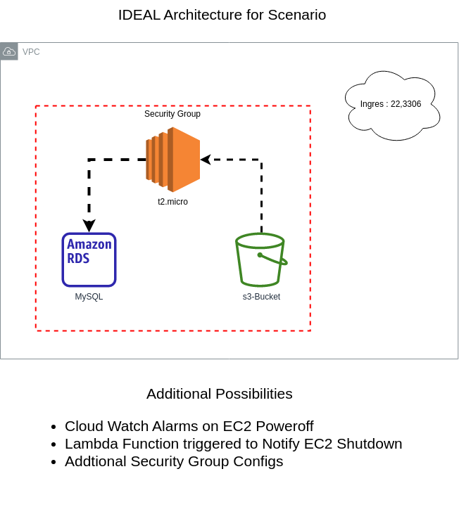

# Cloudformation Devops
## Tasks
-[x] Deploy an EC2 instance which will "fetch MySQL data dump" from an S3 bucket.

-[x] Instance is required to "fetch the data" from the S3 bucket and then write it to an RDS database. 

-[x] After the data has been transferred, the instance should change its state from Running to Stopped. 

## Aim
1. Develop Seperate Cloudfromation templates in yaml for each service involved
2. Create parameter files for each Cloudformation template.
3. Develop a bash script that deploys the Cloudformation templates using parameters from the parameter files

## Architecture Diagram

# My Attempt
within the short time I had to attempt this I managed to setup 3 templates and parameter files with cloudfront , each service is divided into its respective folder as suggested in the requirements.
For deployment I wrote my own bash script and a utility node js script for JSON handling.

## Flow of the script
- deploy S3 Bucket & RDS
- Wait until S3 is deployed and push DB.Zip to it
- Wait until RDS-MySQL is deployed
- Deploy EC2 instance
    - parameters passed in here are
    - db hostname and creds
    - zip file link

# What More could be done ?
The Directory structure and general code can be cleaned up , if the requirement for having seperate template files is removed . For now my S3 bucket and RDS is publicly accessible however it should not be so , the infrastructure should be setup in a vpc and security groups should be configured to allow for only one ingress rule that is the RDS MySQL server just to see if the DB was dumped correctly.

A Cleanup scrupt can also be included to close down resources if they are no longer needed , such as the S3 bucket. StackSets and StackInstances can also be integrated if this is a repeated task .

